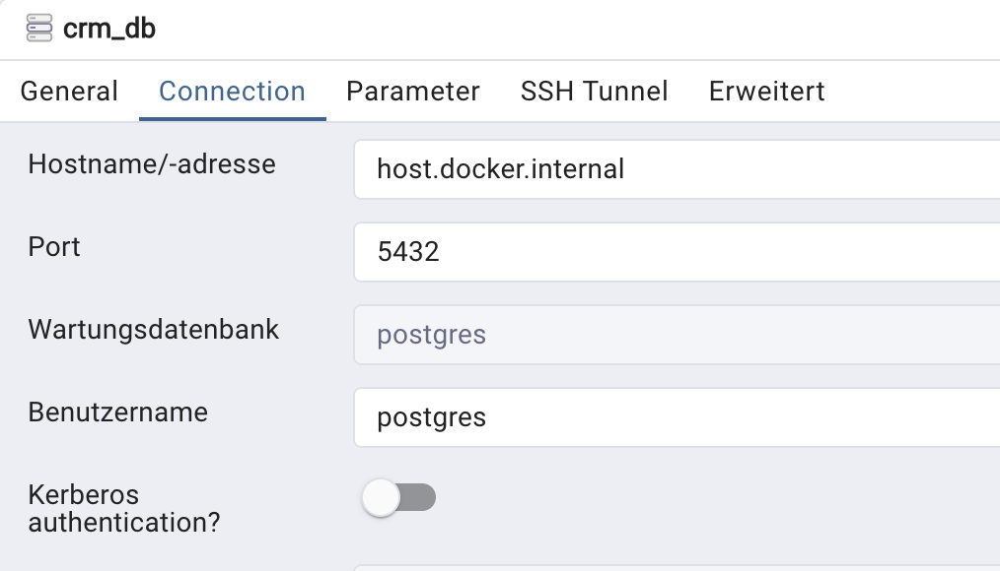

Golang mock database https://stackoverflow.com/questions/75798345/golang-create-a-mock-database-with-handler-and-call-to-database-using-interfaces
database conenctions https://www.calhoun.io/connecting-to-a-postgresql-database-with-gos-database-sql-package/

vs code debug for golang https://vscode-debug-specs.github.io/go/

